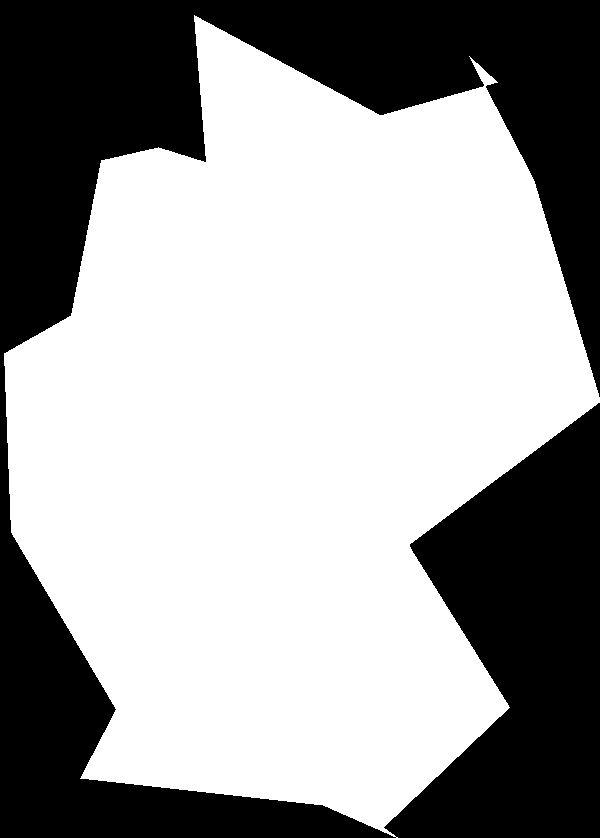

# evo_path

> Evolves a shoreline simplification

[Someone asked](https://www.reddit.com/r/zekach/comments/hmkjx6/how_could_this_be_automated/)
how you could automatically [simplify a shoreline](https://www.reddit.com/r/MapPorn/comments/hmdoy8/map_of_japan_made_from_5_to_500_edges/).
I got a bit very much into it.

## Table of Contents

- [Usage](#usage)
- [Performance](#performance)
- [TODOs](#todos)
- [NOTDOs](#notdos)
- [License](#license)
- [Contribute](#contribute)

## Usage

`./evolve.py [GREYSCALE_IMAGE [NUM_LINES]]`

An example run looks like this:

```
$ ./evolve.py germany-bw-small.png
run_id = T1594238511560_R3c152007
Generation 0
Generation 1
[… SNIP …]
Generation 76
Generation 77
Generation 78
Generation 79
Success. Written to output/result_T1594238511560_R3c152007_P6928749.png and output/result_T1594238511560_R3c152007_P6928749.txt
```

And here's what the result looks like:



## Performance

Processing power: Terrible. The bottleneck is evaluating the penalty.

Quality: Excellent. Just 80 generations, and a population of 20-40 specimen
results in a rather well-recognizable map. I like it :D

## TODOs

* Optimize penalty computation
* Rewrite in Rust?
* Check for handedness, especially with low line counts
* Turn up the numbers, these are rookie numbers!
* Implement additional final cleanup-pass
* Implement [advanced approaches](https://www.reddit.com/r/zekach/comments/hmkjx6/how_could_this_be_automated/fx79ton/)

## NOTDOs

Here are some things this project will definitely not support:
* Disconnected landmasses
* Completely different approaches

## License

All the code and documentation is MIT licensed.

The images are public domain, and are based on other public domain material ([Germany-Outline.svg, version 30 June 2010](https://commons.wikimedia.org/wiki/File:Germany-Outline.svg)).

There are many pieces of code with do "something something evolution something something image".
Hence I would like to tag this particular implementation like so:

### IRREGULAR RIDDANCE VIOLA

Please change this flavor identifier when redistributing modified versions.
The tag `"flavor": "IRREGULAR_RIDDANCE_VIOLA"` is also included into the output to identify output from this implementation. You could call it … flavor text! :D

If you want to reproduce this identifier, you can try getting inspired by running `shuf -n5 /usr/share/dict/american-english` on your system.

## Contribute

Feel free to dive in! [Open an issue](https://github.com/BenWiederhake/evo_path/issues/new) or submit PRs.
